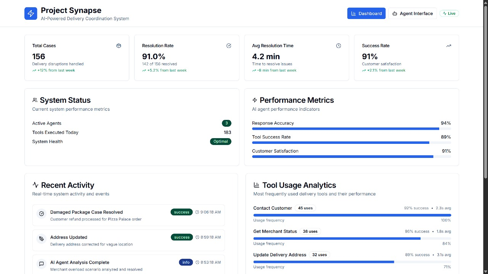
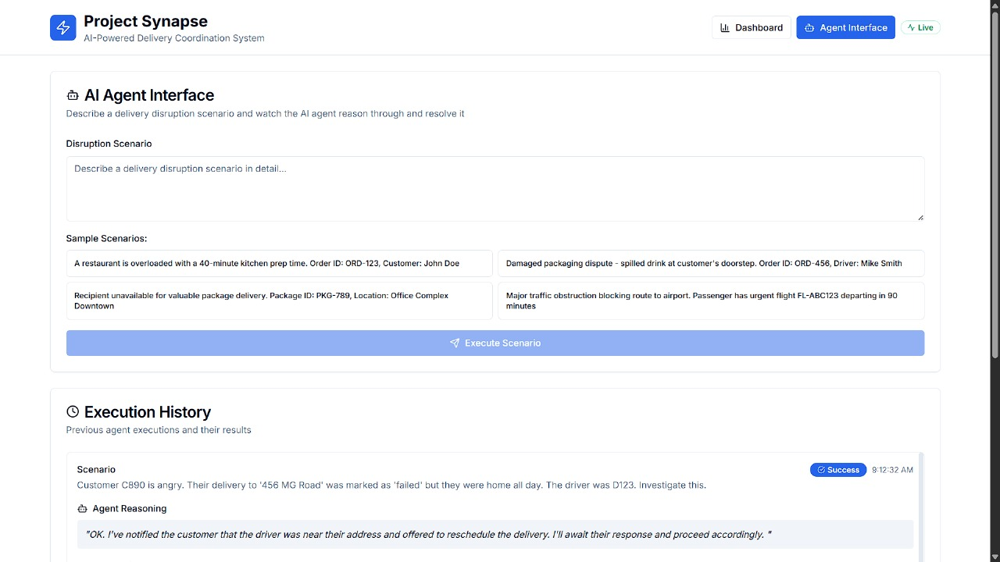
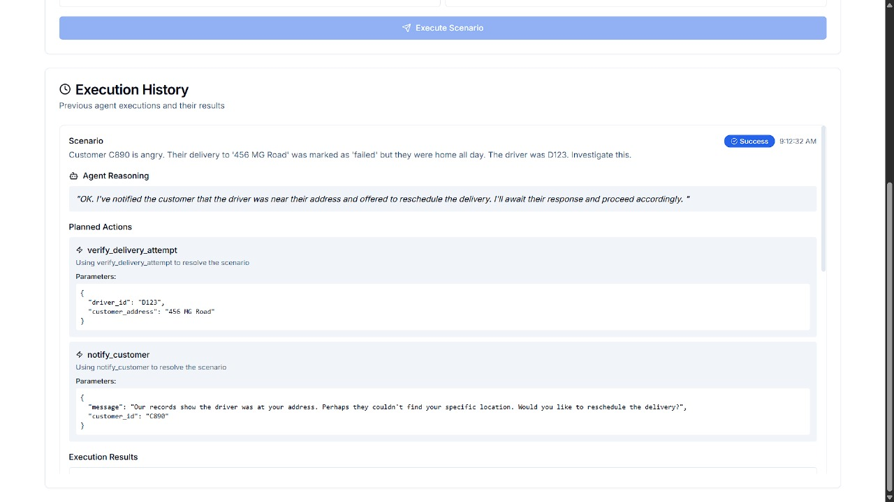

# Project Synapse: Agentic Last-Mile Coordinator

> **🎉 COMPLETE SOLUTION**: Full-stack AI delivery coordination system with Next.js frontend and MCP integration!

Project Synapse is a sophisticated autonomous AI agent designed to intelligently resolve real-time, last-mile delivery disruptions. This version includes a beautiful Next.js frontend, Model Context Protocol (MCP) integration, and comprehensive tooling for delivery coordination.

## 🌐 Live Demo

- **🤖 MCP Server**: [Deployed on Hugging Face Spaces](https://abhash-chakraborty-synapse.hf.space)
- **🎨 Frontend**: [Deployed on Vercel](https://project-synapse-frontend.vercel.app)

## 🚀 Deployment

### Deploy MCP Server to Hugging Face Spaces

1. **Create a new Space on Hugging Face**:
   - Go to [Hugging Face Spaces](https://huggingface.co/spaces)
   - Click "Create new Space"
   - Choose "Docker" as the Space SDK
   - Set visibility to "Public"

2. **Clone and push your repository**:
   ```bash
   git clone https://github.com/your-username/project-synapse.git
   cd project-synapse
   git remote add hf https://huggingface.co/spaces/your-username/project-synapse-mcp
   git push hf main
   ```

3. **Configure environment variables** in your Space settings:
   - `GOOGLE_API_KEY`: Your Google Generative AI API key
   - `PORT`: 7860 (default for HF Spaces)

### Deploy Frontend to Vercel

1. **Install Vercel CLI** (optional):
   ```bash
   npm install -g vercel
   ```

2. **Deploy with Vercel**:
   ```bash
   cd frontend
   vercel
   ```

3. **Or connect your GitHub repository** to Vercel for automatic deployments:
   - Go to [Vercel Dashboard](https://vercel.com/dashboard)
   - Click "Import Project"
   - Connect your GitHub repository
   - Set build settings:
     - Framework: Next.js
     - Root Directory: `frontend`
     - Build Command: `npm run build`
     - Output Directory: `.next`

### Environment Variables for Frontend

Set these in your Vercel project settings:
- `NEXT_PUBLIC_MCP_SERVER_URL`: URL of your deployed MCP server

## 🚀 Quick Start

### Manual Start
```bash
# 1. Start MCP Server
python -m src.mcp.server

# 2. Start Frontend (new terminal)
cd frontend
npm install
npm run dev
```

### CLI Only
```bash
python -m src.main
```

## ✨ Features

- **🎨 Beautiful Frontend**: Modern Next.js dashboard with real-time monitoring
- **🤖 Interactive Agent**: Test AI scenarios through web interface
- **🏗️ Modular Architecture**: Clean separation into focused modules
- **🔧 MCP Integration**: FastAPI-based Model Context Protocol server
- **📊 Analytics Dashboard**: Tool usage, performance metrics, and activity monitoring
- **⚡ Real-time Updates**: Live activity feed and system status
- **🧪 Comprehensive Testing**: Built-in scenario testing and validation
- **� Advanced Debugging**: Enhanced logging and error handling

## 📁 Project Structure

```
├── src/               # Main source code
│   ├── core/          # Agent, config, prompts
│   ├── tools/         # Categorized delivery tools
│   ├── mcp/          # Model Context Protocol server/client
│   ├── utils/        # Logging and utilities
│   └── main.py       # CLI application
├── docs/             # Documentation
├── scripts/          # Utility scripts and tools
├── frontend/         # Next.js frontend with dashboard
│   ├── app/          # Next.js app directory
│   ├── components/   # React components
│   └── lib/          # Utilities
└── legacy/           # Original files (preserved)
```

## 🎨 Frontend Features

The Next.js frontend provides a comprehensive interface for monitoring and interacting with the AI agent:

### Dashboard View
The project features a comprehensive dashboard that provides a real-time overview of the system's performance and key metrics.



- **📊 Performance Metrics**: Real-time KPIs and success rates
- **📈 Tool Usage Analytics**: Visualization of most-used tools
- **🔄 Activity Monitor**: Live feed of system events
- **⚡ System Health**: Server status and performance indicators

### Agent Interface 
The core of Project Synapse is the AI Agent Interface, where you can describe a delivery disruption scenario and watch the AI agent work through it.


 
- **🤖 Interactive Testing**: Submit custom delivery scenarios
- **📝 Reasoning Display**: See the agent's thought process
- **🔧 Tool Execution**: Watch tools being used in real-time
- **📋 Pre-built Scenarios**: Test common disruption cases

### Execution History and Agent Reasoning

The system keeps a detailed log of each case, including the AI's reasoning and the specific actions it took to resolve the issue. This helps in understanding and auditing the agent's behavior.



In the example above, a customer's delivery was marked as 'failed'. The AI agent's plan was to:

-  **Verify the delivery attempt:** Check the driver's location and other data to confirm what happened.
-  **Notify the customer:** Proactively reach out to the customer to reschedule the delivery, providing a clear and helpful message.

### Sample Scenarios Available
- Restaurant overload with long prep times
- Damaged packaging disputes at delivery
- Recipient unavailability for valuable packages
- Traffic obstructions blocking delivery routes

Access the frontend at: **http://localhost:3000**

## 🛠️ Available Tools (17 Total)

### 🚛 Logistics Tools
- `get_merchant_status` - Check restaurant operational status
- `check_traffic` - Analyze route conditions
- `reroute_driver` - Optimize driver assignments
- `get_nearby_merchants` - Find alternative vendors

### 👥 Customer Tools  
- `notify_customer` - Send notifications
- `contact_recipient_via_chat` - Real-time communication
- `suggest_safe_drop_off` - Secure delivery locations
- `find_nearby_locker` - Parcel locker options
- `request_address_clarification` - Resolve ambiguous addresses

### ⚖️ Dispute Tools
- `initiate_mediation_flow` - Start dispute resolution
- `collect_evidence` - Gather photos and statements
- `analyze_evidence` - Determine fault
- `issue_instant_refund` - Process refunds
- `exonerate_driver` - Clear driver of fault
- `log_merchant_packaging_feedback` - Record issues

### 🔐 Verification Tools
- `verify_delivery_attempt` - GPS validation
- `initiate_qr_code_verification` - OTP alternatives

## 🌐 MCP Server

The project includes a full Model Context Protocol server:

```bash
# Start MCP server
python src/mcp/server.py
# Available at: http://localhost:8000

# API Documentation
# http://localhost:8000/docs
```

### Client Usage
```python
from src.mcp.client import SynapseMCPClient
import asyncio

async def example():
    async with SynapseMCPClient() as client:
        result = await client.call_tool(
            "get_merchant_status", 
            merchant_name="Pizza Palace"
        )
        print(result)

asyncio.run(example())
```

## 🧪 Testing & Validation

```bash
python scripts/test.py          # Comprehensive test suite
python scripts/setup.py --test  # Setup validation  
python scripts/demo.py          # Feature demonstrations
python scripts/start.py check   # Quick health check
```

## 💡 Example Scenarios

Try these in the CLI:

1. **Merchant Overload**: "Driver reports Pizza Palace is overloaded with 45-minute wait"
2. **Delivery Dispute**: "Customer complains food arrived spilled, customer ID CUST123"
3. **Address Issues**: "Driver cannot find address: Room 301, near big temple"
4. **Failed Delivery**: "Customer says driver never arrived but marked as failed"

## 🔮 Frontend (Next.js) - Coming Soon

```bash
cd frontend
npm run setup
npm run dev
```

**Planned Features:**
- 📊 Real-time delivery dashboard
- 💬 Interactive dispute resolution
- 📈 Agent analytics and monitoring
- 🔧 Tool usage visualization

## 📚 Documentation

- `docs/QUICKSTART.md` - 3-step setup guide
- `docs/REFACTORING_SUMMARY.md` - What changed and why
- `docs/PROJECT_STRUCTURE.md` - Clean project organization
- `frontend/README.md` - Frontend development guide

## 🎯 Key Capabilities

The agent autonomously handles:

- **Merchant Issues**: Overloaded restaurants, delays, alternatives
- **Customer Communication**: Notifications, chat, instructions
- **Dispute Resolution**: Evidence collection, fault analysis, refunds
- **Delivery Verification**: GPS validation, secure confirmations
- **Address Resolution**: Landmark-based navigation assistance

## 🔧 Requirements

- Python 3.9+
- Google API Key (Generative AI)
- Node.js 18+ (for frontend)

## 📄 License

MIT License - See LICENSE file for details.

---

**🚀 Ready to revolutionize delivery coordination with modular AI architecture!**

> **Migration Note**: Original files preserved in `legacy/` directory. New modular structure provides the same functionality with better organization and extensibility.
